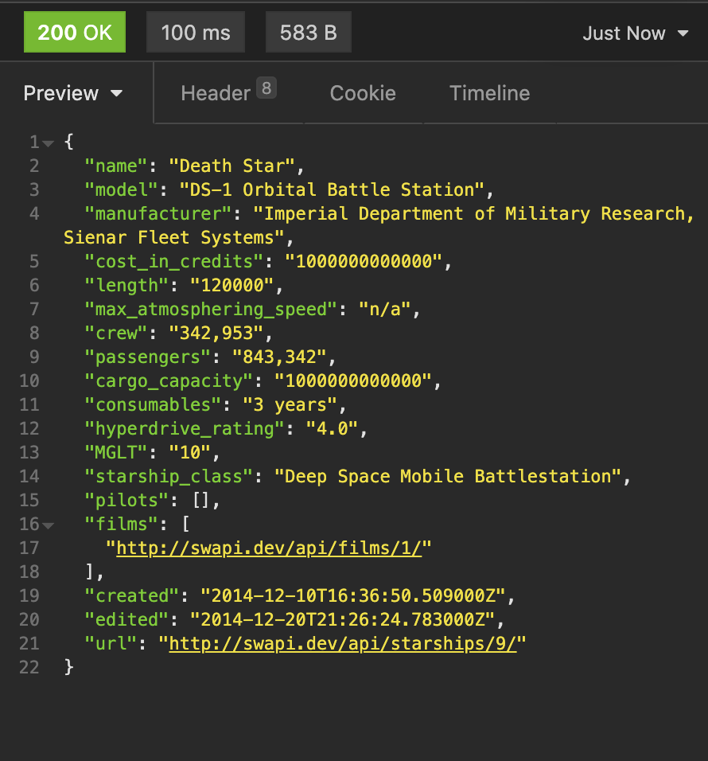
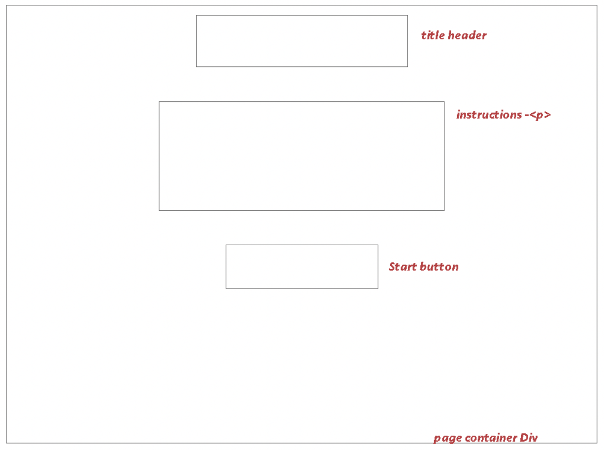
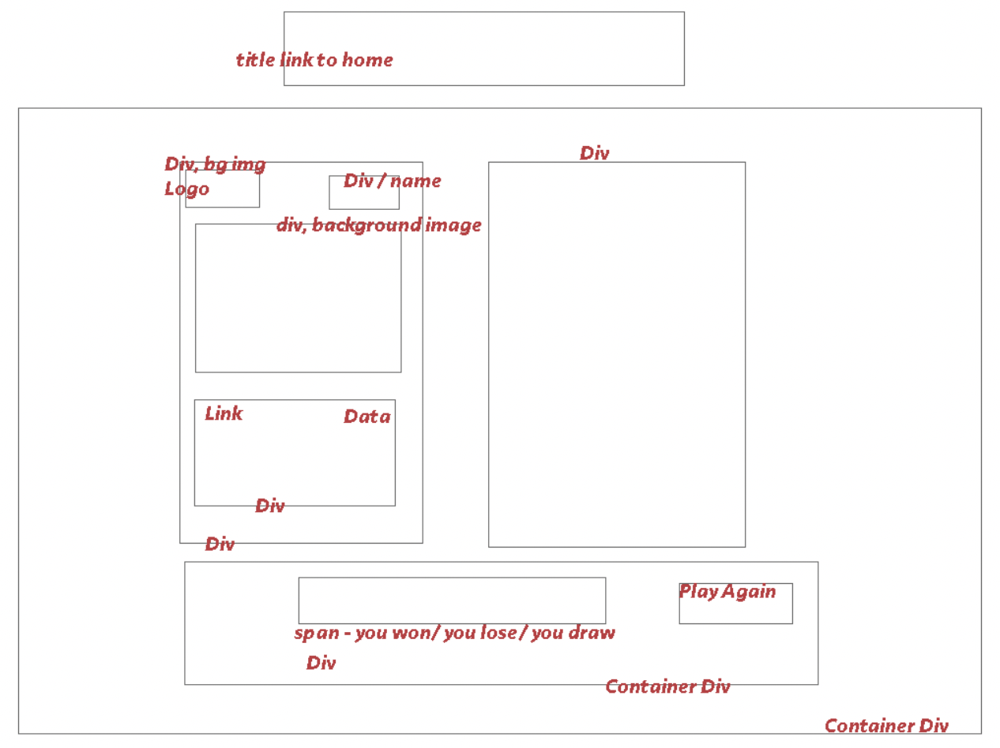

# Project Two Reactathon - Star Trumps

## Contents
[Overview](#overview)<br/>
[Deployed Project](#project)<br/>
[Code Installation](#install)<br/>
[Technologies Used](#tech)<br/>
[Brief](#brief)<br/>
[Process](#process)<br/>
[Bugs](#bugs)<br/>
[Challenges](#challenges)<br/>
[Wins](#wins)<br/>
[Future Improvements](#future)<br/>
[Key Learning](#learning)<br/>


## <a name="overview"></a>Overview
The second Project on the SEI Immersive Course was to build a React application that consumes a public API. We had **48 hours** to complete this in a pair. My partner ([Anna Monkman](https://github.com/annamonkman)) and I chose to make a simplified game of Top Trumps using a Star Wars API.
</br>

## <a name="project"></a>Link to Deployed Project
Find our deployed project [here](https://star-trumps.netlify.app/). </br>
**Directions:** Press the start button, click on a category on the upfacing card to beat the down facing card. Please note that the image doesn’t change on the card but the information does. 

## <a name="install"></a>Code Installation
* Clone or download the repo.
* Open terminal in VSCode and type `yarn && yarn start` to install yarn and start the server.

### Demo


## <a name="tech"></a>Technologies Used
**Front-End:**
* React.js (hooks)
* JavaScript (ES6)
* JSX
* SCSS
* Axios
* React Router DOM
</br>

**API Used:**
* [Star Wars API](https://swapi.dev/)
</br>

**Dev Tools:**
* Insomnia REST Client
* Yarn
* VSCode
* Git
* Github
* Google Chrome Dev Tools
* Adobe Photoshop
* Netlify (deployment)
* Fontmeme.com (for header logo)

## <a name="brief"></a>Brief
The app must:
* Consume a public API.
* Have several components.
* Can have a router - with several “pages”.
* Include Wireframes designed before building the app.
* Be deployed online.

## <a name="process"></a>Process

### Planning
Since the brief was more open ended we spent a good amount of time coming up with an idea that suited what we both wanted to get out of the project. </br>
</br>
We looked through catalogues of external APIs for some inspiration. We both like Star Wars and found a Star Wars API. We thought this had potential either for a simple database type of project or something more interactive, since it had a large range of data and was free and accessible. I suggested Top Trumps as I used to play Star Wars Top Trumps a lot as a child, so we both tried to figure out how to do something similar that was achievable in the day and a half we had remaining. </br>
</br>
We planned an MVP that would just be a simple comparison between two cards with win, lose and draw logic, with nice-to-haves being rounds of the game and an index of all of the cards. The Star Wars API had many different categories so we chose to focus on one - Starships - at first as it had the most easily comparable data, ie. lots of numbers. We practised accessing the data sets in Insomnia to make sure it was suitable for our purposes. </br>
</br>

#### Example of Data from API in Insomnia


I wireframed the two basic pages in Photoshop, screen sharing with Anna. Then we wrote pseudocode before getting our plan signed off by the tutors. </br>
</br>

#### Wireframe for Home Component

#### Wireframe for Gameplay Component


### Setting Up React
We used the GA London React Template. `npx create-react-app APP_NAME --template cra-template-ga-ldn`. We installed React Router DOM and Axios. </br>
We decided to code the majority of the project using Live Share in VSCode, whilst talking on Zoom, since we were both quite new to React and thought we would be more efficient if we worked through it together. </br>


### Building the Components
We created the components: Home.js, Header.js, CardIndex.js and CardInfo.js. In each we made our imports and wrote a JavaScript function. In App.js we routed the components. </br>
</br>
The Home and Header are very simple componets that just have to link to other places, using the Link from React Router DOM. The Home links to the game and the Header links to Home. </br>
</br>
Initially we retrieved the data from our external API in the CardIndex Component to pass as props to CardInfo. Quickly we realised this wasn't going to work for us based on our limited experience with React and decided it would be more straightforward to just hard-code two cards on the same component as the game logic. </br>
</br>
So we created a new component - CardShow - that would be our game-play component. We retrieved the data using Axios and stored it in State. We kept the CardIndex and CardInfo incase we wanted to create an index display of all the cards.</br>

```javascript
const [cards, setCards] = useState(null)

useEffect(() => {
    const getData = async () => {
      const response = await axios.get('https://swapi.dev/api/starships/')
      setCards(response.data.results)
    }
    getData()
  }, [])
```
In JSX we coded the structure of the cards, one div for the up-facing card and one for the down-facing card. 

### Game Logic
To set the data for the first card to be displayed on screen we created a useEffect that would choose a random card out of the 10 we had. 
```javascript
const [cardFaceUp, setCardFaceUp] = useState('')

useEffect(() => { 
    if (!cards) return null
    setCardFaceUp(cards[Math.floor(Math.random() * 10)])
  }, [cards])
```

We had all the the game-play logic in a handleSubmit which ran when the player clicked on a button on the up-facing card. 

win/lose/draw logic: 
```javascript
    if (cardFaceUpName < cardFaceDownName) {
      setResult('lose')
    }
    if (cardFaceUpName > cardFaceDownName) {
      setResult('win')
    }
    if (cardFaceUpName === cardFaceDownName) {
      setResult('draw')
    }
    setHasClickedEvent(true)
  }
```

I coded the flipping card detail using a ternary operator in the JavaScript and backface-visibility in the CSS. 

### Manipulating the data
It was very important that the data could be compariable with one another. This was something that was frustrating at first because we didn't for-see how mixed some of the data would be in our data set. 
We figured out that we had to:
- Change all data to a Number data type.
- Remove all commas, etc.
- Turn any non-number (ie. n/a) into a number (0).

```javascript
cardFaceUpName = cardFaceUpName.replace(/,/g, '')
```
```javascript
if (cardFaceUpName === 'n/a' || cardFaceUpName === 'unknown' ) {
      cardFaceUpName = 0
    }
    if (cardFaceDownName === 'n/a' || cardFaceDownName === 'unknown') {
      cardFaceDownName = 0
    }
```

### Play Again
This would set another two random cards.
```javascript
const handlePlayAgain = event => {
    event.preventDefault()
    setCardFaceDown(cards[Math.floor(Math.random() * 10)])
    setCardFaceUp(cards[Math.floor(Math.random() * 10)])
    setHasClickedEvent(false)
    setResult('')
  }
```

### Styling 
Once we’d finished our MVP we went straight into styling. We split up at this point to get it done quicker, allocating ourselves different areas so our code didn’t cause any merge conflicts. </br>
</br>
Anna added in the title that I made on fontmeme.com and worked on the cards - adding in the background image and logo, whilst I worked on the homepage then the win/lose/draw display on the game page. </br>
</br>
I scanned the back of one of my own Top Trump cards and uploaded it to be used as the back of our Star Trumps card. It would be nice to make the front of our cards authentically like the original top trumps cards, with curved edges and a similar design. I also sourced the images for all of the starships which we unfortunately did not get round to adding in.

## <a name="bugs"></a>Bugs
* We managed to solve our major game play bugs before the Reactathon ended. 
* The only major thing we didn't have time to complete was getting our own images to display on the cards according to the starship it pictures. We had to just stick to one general image of Starships. 

## <a name="challenges"></a>Challenges
* A very big obstacle we faced was that when we clicked on the buttons we would get errors. Eventually we figured out it was because we had our onClick event on the span when it should have been on the button element.
* Getting the images to show. Our url link didn't work, so we had to import it at the top. 
* There was a merge conflict with our CSS very close to the end that we had to sort quickly. 
* The API's data was more varied than we'd anticipated so we had to spend a good amount of time manipulating it for our comparisons. 
* The lack of images in the API was an issue we ran out of time to get around. 

## <a name="wins"></a>Wins
* Getting the game to work at MVP level.
* Pair-coding successfully. In coding the functionality together we could work through the more difficult bits together and impart each of our knowledge. It also meant we knew exactly what had to be done at all times- we were both on the same page. Towards the end our brains were getting tired but by working together we were able to push through. 
* Taking a risk and building an app that was more than just retrieving and displaying data. 

## <a name="future"></a>Future Improvements
* Show the correct image with the correct card.
* Make styling on cards more realistic. 
* Have rounds of the game.  

## <a name="learning"></a>Key Learning
* Collaborating creatively and Pair-coding successfully.
* Keeping the code organised and commenting it.
* Look in depth at the API's data in Insomnia to for-see issues with it.
* Console logging regularly.


